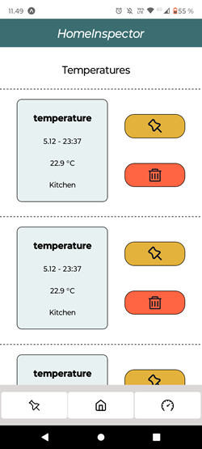
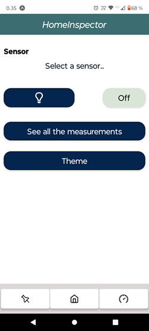

# **HomeInspector**
 
## Esp32-Express-Firebase-ReactNative

This is a project where I use ESP32-WROOM-32D board to read data from DHT22 humidity/temperature sensor. This data is then sent to my REST API which I have made with express web application framework. 
The API uses firebases firestore to store the data. Then a mobile phone application that is made with React-Native fetches this data and shows it in a readable way on the app. 
The project is still in production.

## Here are some pictures

### HomeScreen

### MetricsScreen

### ControlScreen

### PinnedScreen

