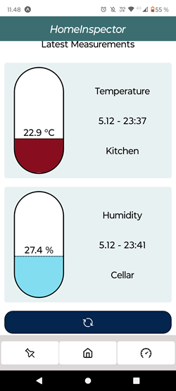
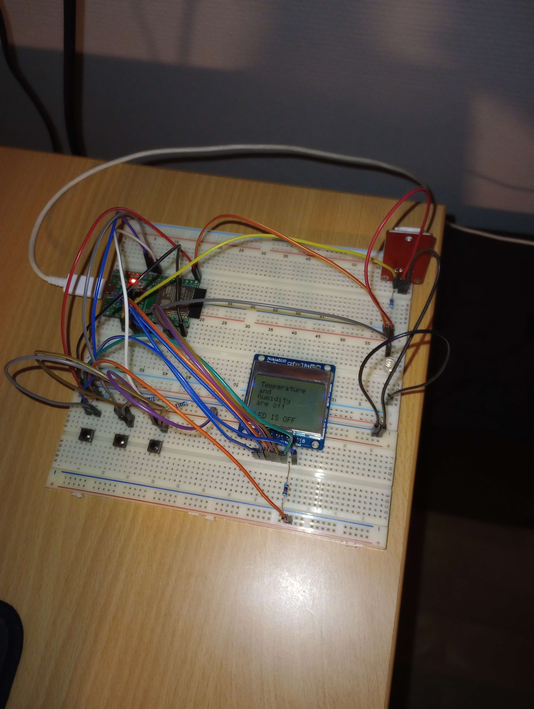

# **HomeInspector**
 
## Esp32-Express-Firebase-ReactNative

There are four blocks to this project;

- ESP32 (ESP32CODE)
- Server (backend)
- Mobile app (frontend)
- Firebase firestore

### ESP32: 
I have connected to it 3 components that are nokia5110-screen to display set of predefined info screens that depend on the states of a led and DHT22 sensor
for example, "Temperature data and that a led is on". Or that "Temperature off, humidity off and led is on". There are also three buttons connected to the board so that I can switch the light/temperature/humidity on manually.

### Server:
This is what controls everything. It is a node.js express server that receives data from the ESP32 or from mobile app. for example if ESP32 sends a temperature reading to server, the server will then save it to firebase. Or if I turn off the lights from the mobile app, the server will receive a state and tell ESP32 to turn off the lights.

### Mobile app:
This is the main interface, where all the readings are displayed. It has homeScreen for the latest reading of temperature and humidity. A control Screen where I can turn on the lights/humidity/temperature. Or set a location for the device (although DHT22 has both sensor in it, I can set different locations for both humidity and temperature). There is also MetricsScreen where I can see all the past readings and delete the readings I don't like or pin readings I like. And the final screen is the pinnedScreen where the pinned readings are displayed. There I can add a note for the reading or just unpin the reading.

### Firebase firestore:
This is a noSQL database where I save the temperature and humidity readings. 

The project is still in production.

## Here are some pictures

| **HomeScreen** | **MetricsScreen** |
|------------|---------------|
|  |  |

| **ControlScreen** | **PinnedScreen** |
|---------------|--------------|
|  |  |

**Board**

more pictures at the picture folder
